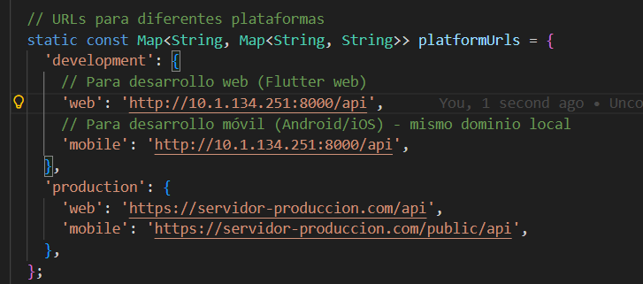

# Instrucciones para ejecutar

## Primero

- En el frontend vaya a la carpeta de lib/services y modifique el archivo config.dart



- Va a poner su ip de la siguiente forma

```
"http://tuip:8000/api"
```
#### Nota: No funciona en web

## Segundo

Ejecuta los siguientes comandos para iniciar el server
- Composer install
- php artisan migrate
- php artisan db:seed

Ejecutar el siguiente comando en el back:

```
 Tu ruta donde esta tu proyecto\PruebasClaseConstruccion\backend> php artisan serve --host=10.1.134.251 --port=8000
```

Ejecutar el siguiente comando en el front:

```
 Tu ruta donde esta tu proyecto\PruebasClaseConstruccion\frontend> flutter pub get

 Tu ruta donde esta tu proyecto\PruebasClaseConstruccion\frontend> flutter build apk

 Tu ruta donde esta tu proyecto\PruebasClaseConstruccion\frontend> flutter install apk
```
